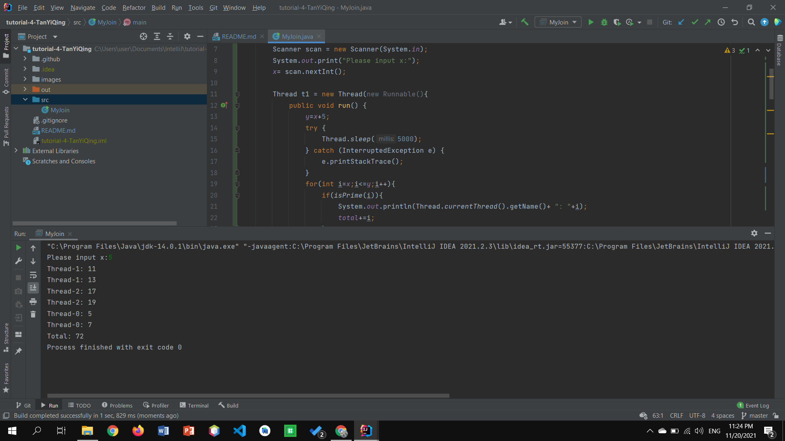

## Your Info:
1. Matric Number: 270607
1. Name: Tan Yi Qing

## Instruction:

1. Study the code below:

   https://github.com/zhamri/STIW3054-RT-Programming/blob/master/src/Week_04/TestJoin1.java

1. Then write a Java program to start __THREE (3)__ threads where:
    * 1st thread will display prime numbers between x and x + 5.
    * 2nd thread will display prime numbers between x + 5 and x + 10.
    * 3rd thread will display prime numbers between x + 10 and x + 15.
   
1. `Thread-1` should finish first and follow by `Thread-2` and `Thread-0`. Then display the total of the prime numbers for the threads. 

1. x is integer number and MUST be input from the keyboard.

1. The program file which has the main method should be named `MyJoin.java` and place in the `src` folder.

1. Screenshot the result and upload to this repo too.

1. Watch the video to clone, add, commit and push a repository to GitHub: https://youtu.be/RXV3Yusr0SI

## Example of the output
```
Please input x: 5

Thread-1: 11
Thread-1: 13
Thread-2: 17
Thread-2: 19
Thread-0: 5
Thread-0: 7
Total: 72
```

## Your Output/Result

